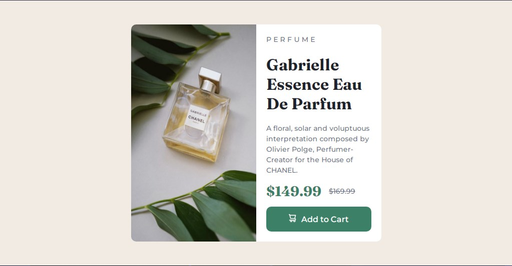

# Frontend Mentor - Product preview card component solution

This is a solution to the [Product preview card component challenge on Frontend Mentor](https://www.frontendmentor.io/challenges/product-preview-card-component-GO7UmttRfa). Frontend Mentor challenges help you improve your coding skills by building realistic projects. 

## Table of contents

- [Overview](#overview)
  - [The challenge](#the-challenge)
  - [Screenshot](#screenshot)
  - [Links](#links)
- [My process](#my-process)
  - [Built with](#built-with)
  - [What I learned](#what-i-learned)
  - [Continued development](#continued-development)
  - [Useful resources](#useful-resources)
- [Author](#author)

## Overview

### The challenge

Users should be able to:

- View the optimal layout depending on their device's screen size
- See hover and focus states for interactive elements

### Screenshot

### Links

- [Solution URL here](https://your-solution-url.com)
- [Live site](https://6xg0d.github.io/product-preview-card-challenge/)

## My process

This was my first time using media queries, so this challenge took me a couple hours more than the previous ones where the design doesn't change much. I can't say i haven't fun tho! At the beginning it was a little bit complicate to me understand how to use queries, but after reading again the Intro of the Path and looking the example i was able to understand enough to solve this challenge. I'm looking forward to learn even more about responsive design! :)

### Built with

- Semantic HTML5 markup
- CSS
- Flexbox
- Mobile-first workflow

### What I learned

I learned a little bit more about SVG when i had to place the icon, a basic understanding about media queries, and the possibility to practice my flexbox skills even more. Also first time using "em" instead of pixel, still getting use to it.

### Continued development

I'm happy with the final result, i think looks pretty close to the design. Spacing it's still a little bit problematic, i know the space between the text and the card isn't exactly the same from the design, but still happy that i completed the challenge with a decent outcome. So if i have to improve something about this design in the future, would be that. 

### Useful resources

- [em calculator](https://nekocalc.com/px-to-em-converter) - This helped me to save time using em instead of pixels.
- [CSS text decoration property](https://www.w3schools.com/css/css_text_decoration.asp) - This is an article from W3SCHOOLS which helped me to remember the values of the text decoration property, in this case: line-through.

## Author

- Frontend Mentor - [@6xg0d](https://www.frontendmentor.io/profile/6xg0d)
